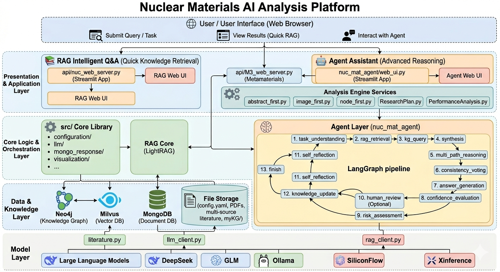

# Nuclear Materials AI Analysis Platform

<div align="center">

**⚛️ RAG + Agent 驱动的核电材料智能分析框架**

[](https://www.python.org/)
[](https://streamlit.io/)
[](https://langchain-ai.github.io/langgraph/)
[](LICENSE)

</div>

---

## 📖 概述

面向 **核电材料研究** 的 AI 科学协作平台，深度融合大语言模型、检索增强生成（RAG）、智能代理（Agent）与知识图谱，提供从快速问答到多步推理的全链路分析能力。

---

## ✨ 核心功能

系统提供两个互补入口，适配不同复杂度：

| 功能 | 定位 | 入口 |
|------|------|------|
| 📚 **RAG 智能问答** | 直接检索生成，快速获取专业知识 | `api/nuc_web_server.py` |
| 🤖 **Agent 助手**   | 内置 RAG 的高级智能体，支持多步推理、反思与人在回路 | `nuc_mat_agent/web_ui.py` |

**RAG 智能问答**  
基于 LightRAG 实现多源文献检索、向量语义搜索与图谱增强召回，支持材料辐照、腐蚀、寿命评估等场景。

**Agent 助手**  
基于 LangGraph 构建 13 节点流水线：任务理解 → RAG 检索 → 图谱查询 → 综合分析 → 多路径推理 → 一致性投票 → 置信度与风险评估 → 可选人工审核 → 自我反思 → 知识更新。适用于材料对比、标准合规、性能评估、失效分析等复杂任务。

---

## 🏗️ 系统架构



### 项目结构

```
mechpy_nuc_mat_1/
├── main_entry.py                # Streamlit 主入口
├── api/                         # RAG 服务与专业分析引擎
│   ├── nuc_web_server.py        # RAG 问答服务
│   ├── M3_web_server.py         # 超材料分析
│   ├── config.yaml
│   ├── abstract_first.py        # 摘要检索
│   ├── image_first.py           # 图像检索
│   ├── node_first.py            # 图谱查询
│   ├── ResearchPlan.py          # 研究计划生成
│   └── PerformanceAnalysis.py   # 性能分析
├── nuc_mat_agent/               # Agent 层
│   ├── agent_v2.py              # LangGraph 核心
│   ├── web_ui.py                # Agent Web 界面
│   ├── rag_client.py            # RAG 客户端
│   ├── llm_client.py            # LLM 封装
│   └── prompts.py               # 提示词模板
├── src/                         # 核心库
│   ├── configuration/
│   ├── llm/
│   ├── mongo_response/
│   └── visualization/
└── myKG/                        # 知识图谱数据
```

---

## 🔧 技术栈

| 层级 | 组件 |
|------|------|
| 前端 | Streamlit |
| Agent | LangGraph |
| RAG | LightRAG |
| 数据 | Neo4j / MongoDB / Milvus |
| 模型 | DeepSeek / GLM / Ollama / SiliconFlow / Xinference |

---

## 📊 Agent 工作流（13 节点）

| 步骤 | 节点 | 说明 |
|------|------|------|
| 1 | task_understanding | 任务分解 |
| 2 | rag_retrieval | RAG 检索 |
| 3 | kg_query | 图谱查询 |
| 4 | synthesis | 综合分析 |
| 5 | multi_path_reasoning | 多路径推理 |
| 6 | consistency_voting | 一致性投票 |
| 7 | answer_generation | 答案生成 |
| 8 | confidence_evaluation | 置信度评估 |
| 9 | risk_assessment | 风险分级 |
| 10 | human_review | 人在回路（可选） |
| 11 | self_reflection | 自我反思 |
| 12 | knowledge_update | 知识更新 |
| 13 | finish | 完成输出 |

---

## 🚀 快速开始

```bash
git clone <repo-url>
cd mechpy_nuc_mat_1
pip install -r requirements.txt
streamlit run main_entry.py
```

访问 `http://localhost:8501`，根据任务类型选择入口。

---

## 🌟 技术亮点

- 混合检索：向量 + 关键字 + 图谱联合召回
- 多 Agent 协作：LangGraph 状态机编排
- 人在回路：关键节点可引入人工审核
- 自我反思：答案自动评估与迭代优化
- 多模型兼容：支持云端 API 与本地部署

---

## 📞 联系方式

📧 zyx377987701@163.com

---

## 📄 许可证

MIT License